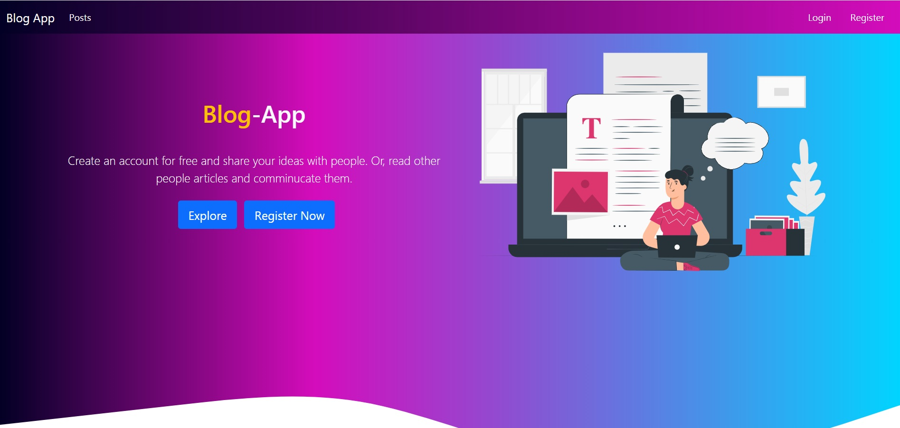
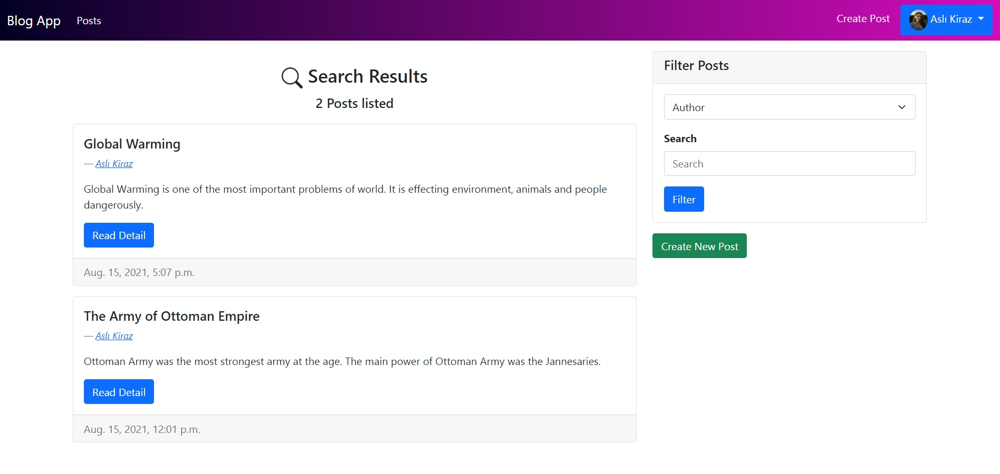

# BlogApp

  

## Summary 
  Blog project is a simple website where people can share articles about a topic. Every user who creates an account can share an article on any topic. People can read shared articles but they cannot write any articles without logging in. Every user has an profile page which consist of profile image and personal informations. Additionally, user can update their profile using this profile page. All articles are paginated and people can filter articles by title, author and text which is in article. 

## Technologies
This project is coded using Python-Django and it uses PostgreSql as its database instead of Django's default SQlite database. Furthermore, frontend design of this project uses Bootstrap.

## Image of App

  

