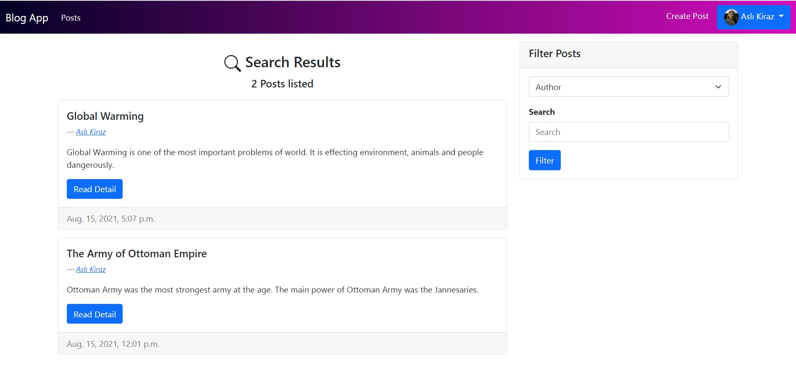

# BlogApp

  

## Summary 
&nbsp;&nbsp;&nbsp;&nbsp; Blog project is a simple website where people can share articles about a topic. Every user who creates an account can share an article on any topic. People can read shared articles but they cannot write any articles without logging in. Every user has an profile page which consist of profile image and personal informations. Additionally, user can update their profile using this profile page. All articles are paginated and people can filter articles by title, author and text which is in article. 

## Technologies
&nbsp;&nbsp;&nbsp;&nbsp; This project is coded using Python-Django and it uses PostgreSql as its database instead of Django's default SQlite database. Furthermore, frontend design of this project uses Bootstrap.

## Layers

### Blog
&nbsp;&nbsp;&nbsp;&nbsp; Blog directory is consist of views, templates, models, urls about posts.

#### &nbsp;&nbsp;&nbsp;&nbsp; models.py
&nbsp;&nbsp;&nbsp;&nbsp;&nbsp;&nbsp;&nbsp;&nbsp; All models about posts is in this file. Such as, Post Model, Author model. Author Model is linked to the Post Model by one-to-many relationship.

#### &nbsp;&nbsp;&nbsp;&nbsp; views.py
&nbsp;&nbsp;&nbsp;&nbsp;&nbsp;&nbsp;&nbsp;&nbsp; This file links the items that are displayed in the UI with html templates. 

#### &nbsp;&nbsp;&nbsp;&nbsp; urls.py
&nbsp;&nbsp;&nbsp;&nbsp;&nbsp;&nbsp;&nbsp;&nbsp; The file where the urls to show the views are set. 

#### &nbsp;&nbsp;&nbsp;&nbsp; templates
&nbsp;&nbsp;&nbsp;&nbsp;&nbsp;&nbsp;&nbsp;&nbsp; All html templates for displaying items in this folder.

### Users
&nbsp;&nbsp;&nbsp;&nbsp; Views, models, urls, templates which are related to user are in this folder.

#### &nbsp;&nbsp;&nbsp;&nbsp; models.py
&nbsp;&nbsp;&nbsp;&nbsp;&nbsp;&nbsp;&nbsp;&nbsp; User model is in this directory.

#### &nbsp;&nbsp;&nbsp;&nbsp; views.py
&nbsp;&nbsp;&nbsp;&nbsp;&nbsp;&nbsp;&nbsp;&nbsp; Register, Login, Profile views are in here. 

#### &nbsp;&nbsp;&nbsp;&nbsp; urls.py
&nbsp;&nbsp;&nbsp;&nbsp;&nbsp;&nbsp;&nbsp;&nbsp; Register, Login, Profile page urls are edited here.

#### &nbsp;&nbsp;&nbsp;&nbsp; templates
&nbsp;&nbsp;&nbsp;&nbsp;&nbsp;&nbsp;&nbsp;&nbsp; HTML templates created here to display registration, login and profile page.

### Media
&nbsp;&nbsp;&nbsp;&nbsp; Image Folder

#### &nbsp;&nbsp;&nbsp;&nbsp; backgrounds
&nbsp;&nbsp;&nbsp;&nbsp;&nbsp;&nbsp;&nbsp;&nbsp; Svg images which are used for design.

#### &nbsp;&nbsp;&nbsp;&nbsp; profileImages
&nbsp;&nbsp;&nbsp;&nbsp;&nbsp;&nbsp;&nbsp;&nbsp; The profile photos of registered user are kept in this folder. 

#### &nbsp;&nbsp;&nbsp;&nbsp; postImages
&nbsp;&nbsp;&nbsp;&nbsp;&nbsp;&nbsp;&nbsp;&nbsp; The articles images are kept in here.

## Images of Project

  

